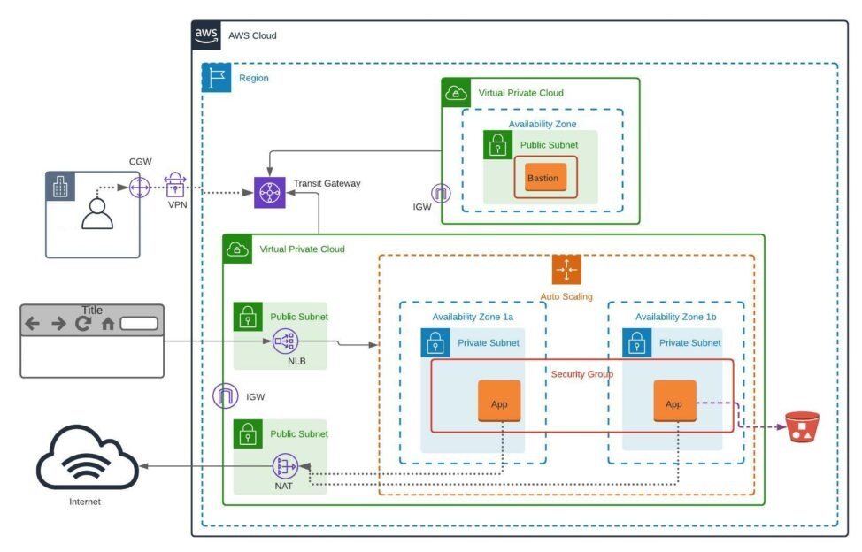

# Amazon VPC

VPC는 AWS 내에서 사용자 정의 가능한 논리적으로 격리된 가상 네트워크이다.
 이를 통해 사용자는 자체 IP 주소 범위, subnet, 라우팅 테이블, 인터넷 게이트웨이 등을 설정하여 
온프레미스 데이터 센터와 유사한 네트워크 환경을 구축할 수 있다.

# 주요 구성 요소

## VPC 및 subnet

- **VPC**

  사용자가 정의한 IP 주소 범위를 갖는 가상 네트워크이다. 
  AWS 리소스(EC2, RDS 등)를 네트워크적으로 논리적으로 분리해서 배치할 수 있는 공간을 의미한다.

- **subnet**

  VPC 내에서 IP 주소 범위를 분할한 하위 네트워크 각각의 subnet은 특정 가용 영역(AZ)에 속하며, 
  public subnet(인터넷과 통신 가능한)과 private subnet(인터넷 통신 차단)으로 나눌 수 있다.

> 참고) AZ (Availability Zone)란? 
> 하나의 리전안에 물리적으로 분리된 데이터센터 단위

## IP 주소 지정
- **IPv4 및 IPv6 지원**

  VPC와 subnet 모두 IPv4와 IPv6 주소를 지원한다.

- **public 및 private IP**

  public IP는 외부 인터넷과 통신하기 위해 EC2 인스턴스에 자동 또는 수동으로 할당 할 수 있다.
  반면, private IP는 VPC 내부 통신용으로 사용된다.

## 라우팅 테이블
- 라우팅 테이블은 subnet 또는 게이트웨이를 통해 흐르는 트래픽의 경로를 제어한다.
- 기본적으로 VPC 내 subnet끼리는 local 라우팅 테이블을 통해 서로 통신할 수 있도록 설정되어 있다.
- public subnet은 외부 인터넷으로 나가는 라우팅(0.0.0.0/0 → IGW)을 추가해야 하며,  
  private subnet은 NAT 게이트웨이를 통한 라우팅을 구성하는 경우가 많다.

## 게이트웨이 및 엔드포인트

- **인터넷 게이트웨이 (IGW)**

  VPC를 public 인터넷에 연결할 때 반드시 필요한 컴포넌트이다. 
  public IP를 가진 리소스는 IGW를 통해 인터넷과 통신한다.

- **NAT 게이트웨이**

  private subnet에 배치된 인스턴스가 인터넷으로 나가는 것은 허용하되, 외부에서 인스턴스를 직접 접근하지 못하게 막는 보안 패턴에 사용한다. 
  (주로 소프트웨어 업데이트, 외부 API 호출 등이 필요한 서버에 활용)

- **VPC 엔드포인트**

  AWS S3, DynamoDB 같은 서비스에 직접 인터넷을 통해 접속하는 대신,   
  VPC 내부 네트워크 경로를 통해 연결할 수 있도록 지원한다. 
  VPC 엔드포인트를 이용하면 데이터가 인터넷을 통과하지 않기 때문에 보안성이 높아진다.

## 보안 구성

- **보안 그룹(Security Group)**

  인스턴스 단위에서 적용되는 가상 방화벽, 인바운드와 아웃바운드 규칙을 설정

- **네트워크 ACL(Network ACL)**

  subnet 단위에 적용되는 방화벽이다. 인바운드, 아웃바운드 각각에 대해 명시적으로 허용/거부 규칙을 설정해야 하며, 
  Stateless 방식이라 응답 트래픽도 명시적으로 허용 규칙을 추가해야한다.

## VPC 피어링 및 전송 게이트웨이

- **VPC 피어링**
  - 서로 다른 VPC 간에 사설 IP로 통신할 수 있도록 연결해주는 기능
  - 동일 계정 내 VPC뿐 아니라 다른 AWS 계정 소유 VPC와도 피어링이 가능해 진다.
    (단, 피어링 연결은 트래픽이 직접 통과하는 구조이므로 VPC 간 IP 범위가 겹치지 않아야한다.)
  - 1:1 직접 연결

- **전송 게이트웨이(Transit Gateway)**
  - 여러 VPC, 온프레미스 네트워크(VPN, Direct Connect 등)를 중앙 집중형으로 연결할 수 있는 허브 역할을 한다.
  - 여러 VPC를 일일이 피어링하는 대신, Transit Gateway를 통해 효율적으로 네트워크를 관리할 수 있다.
