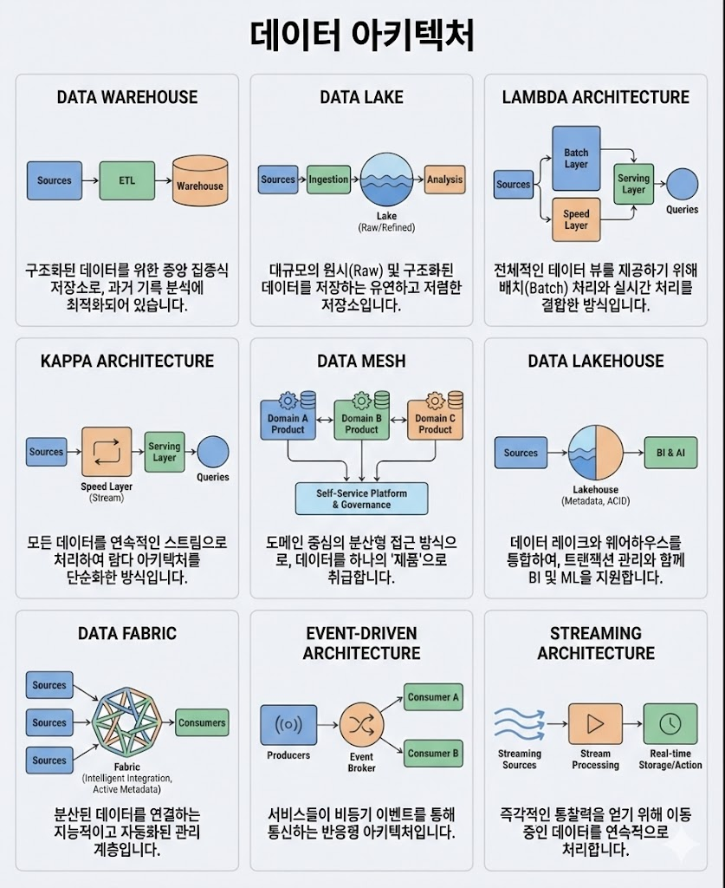

# 26년 데이터 엔지니어가 알아야할 아키텍쳐
> 출처: https://www.linkedin.com/in/christian-acevedo-11379b102/recent-activity/all/

### **Data Warehouse**

- **개념:** 정형 데이터를 구조화하여 저장하고, 의사결정을 위한 분석과 보고서 생성에 최적화된 저장소
- **사례:** 대형 마트 체인에서 지난 3년간의 전국 지점 매출 데이터를 분석하여 계절별 상품 수요를 예측하고 재고를 관리하는 경우

### **Data Lake**

- **개념:** 형식에 구애받지 않고 모든 원시 데이터(이미지, 로그, 텍스트 등)를 대규모로 저장하는 공간
- **사례:** 자율주행차 개발 기업에서 차량 센서로부터 들어오는 방대한 비정형 영상 및 데이터 로그를 모두 수집하여 향후 AI 모델 학습용으로 보관하는 경우

### **Lambda Architecture**

- **개념:** 정확한 분석을 위한 '배치 처리'와 실시간 응답을 위한 '스트림 처리'를 병렬로 운영
- **사례:** 카드사에서 실시간으로 부정 결제를 탐지(스피드 레이어)함과 동시에, 하루 치 데이터를 정밀하게 대조하여 월간 리포트를 생성(배치 레이어)하는 경우

### **Kappa Architecture**

- **개념:** 배치 레이어를 없애고 모든 데이터를 실시간 스트림으로만 처리하여 시스템 구조
- **사례:** 음악 스트리밍 서비스에서 사용자가 방금 들은 곡을 바탕으로 다음 재생 목록을 실시간으로 추천해 주는 엔진

### **Data Mesh**

- **개념:** 중앙에서 통제하지 않고, 각 업무 부서(도메인)가 스스로 데이터를 제품처럼 관리하고 책임지는 분산 방식
- **사례:** 대규모 테크 기업에서 '인사팀'과 '마케팅팀'이 각각 자신들의 데이터를 독립적인 API 형태로 운영하며 필요할 때만 서로 규약에 맞춰 데이터를 공유하는 조직 운영

### **Data Lakehouse**

- **개념:** 데이터 레이크의 저렴한 저장 비용과 데이터 웨어하우스의 고성능 분석 및 데이터 신뢰성 기능을 결합
- **사례:** 핀테크 기업이 방대한 고객 거래 로그를 저장하면서도, 동시에 SQL 쿼리를 통해 실시간으로 자금 세탁 방지(AML) 분석을 수행하는 경우

### **Data Fabric**

- **개념:** 여러 클라우드나 온프레미스에 흩어진 데이터를 이동시키지 않고, 메타데이터를 활용해 가상으로 하나처럼 연결해 관리
- **사례:** 글로벌 제조사가 전 세계 공장별로 서로 다른 데이터베이스를 사용하고 있음에도 불구하고, 본사에서 전체 데이터를 하나의 가상 뷰로 통합 모니터링하는 경우

### **8Event-Driven Architecture**

- **개념:** '주문 완료'나 '로그인' 같은 특정 사건(이벤트)이 발생하면 관련 시스템들이 즉각적으로 반응하도록 설계된 방식
- **사례:** 이커머스에서 고객이 상품을 구매하는 즉시 결제 시스템, 재고 차감 시스템, 배송 시작 알림 시스템이 각각 독립적으로 동시에 작동하는 구조

### **Streaming Architecture**

- **개념:** 데이터가 발생하는 즉시 흐르듯이 처리하여 지연 시간 없이 결과를 도출
- **사례:** 증권사 앱에서 주식 시세가 변동될 때마다 이를 실시간으로 가공하여 사용자의 스마트폰 화면에 0.1초 단위로 업데이트해 주는 서비스