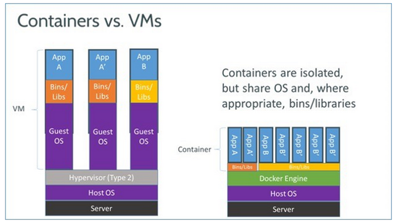

## Docker와 VM의 차이

| 구분           | Docker                                         | VM (가상 머신)                               |
|---------------|------------------------------------------------|---------------------------------------------|
| 아키텍처       | 호스트 OS 위에 **컨테이너 엔진** 실행            | 하이퍼바이저 위에 **게스트 OS** 실행            |
| 커널 공유      | 호스트 OS의 커널을 공유하여 경량 프로세스 격리    | 각 VM이 독립적인 OS와 커널을 포함               |
| 성능           | 경량, 빠른 시작 시간                            | 무겁고 시작 시간이 비교적 느림                 |
| OS 종속성      | 동일 커널 기반(일반적으로 리눅스), Windows 컨테이너는 Windows Server 필요 | 각 VM이 별도의 OS를 가지므로 다양한 OS 사용 가능 |
| 자원 활용       | **공유 커널**로 인해 메모리 및 CPU 사용 효율적    | 각 VM이 독립적인 OS를 가지므로 오버헤드 발생     |
| 격리 수준       | 프로세스 수준 격리 (커널 공유, 네임스페이스 사용) | 완전한 OS 격리 (하드웨어 수준)                   |
| 이미지 크기     | 작고 경량 (수백 MB 수준)                         | 크고 무거움 (수 GB 수준)                        |
| 배포 및 관리    | Docker 이미지로 쉽게 배포 가능                   | VM 이미지는 복잡하고 크기가 큼                 |
| 보안 수준       | 커널 공유로 인해 보안 취약점이 호스트와 컨테이너에 동시에 영향을 줄 수 있음 | 각 VM이 독립된 커널을 가지므로 높은 보안성        |
| 사용 사례       | **마이크로서비스**, CI/CD 파이프라인, 경량 애플리케이션 | **다양한 OS 테스트**, 기존 서버 애플리케이션 호스팅 |



### 추가 

1. **아키텍처**  
   - Docker는 호스트 OS의 커널을 공유하며, 각 컨테이너는 사용자 공간에서 독립된 프로세스로 실행됨.  
   - VM은 하이퍼바이저를 통해 각 게스트 OS가 독립된 커널을 포함하여 실행됨.  

2. **성능 및 자원 활용**  
   - Docker는 호스트 OS의 커널을 공유하므로, VM에 비해 메모리와 CPU 사용이 적음.  
   - 애플리케이션 실행 속도가 빠르며, 배포 및 관리가 용이함.  

3. **격리 수준**  
   - Docker 컨테이너는 호스트 OS의 커널을 공유하면서 네임스페이스와 cgroups를 이용해 프로세스 수준 격리를 제공함.  
   - VM은 하이퍼바이저를 통해 완전한 OS 격리를 제공하여 보안성이 높음.  

4. **보안 수준**  
   - Docker 컨테이너는 호스트 OS의 커널을 공유하므로, 커널에 취약점이 있을 경우 모든 컨테이너가 영향을 받을 수 있음.  
   - VM은 각자 독립된 커널을 사용하여 한 VM의 보안 문제가 다른 VM이나 호스트에 영향을 주지 않음.  

---

Docker와 VM은 각각의 장단점이 있으므로, **사용 목적과 환경**에 따라 적절한 선택이 필요함.


### CMD와 ENTRYPOINT
CMD와 ENTRYPOINT는 Dockerfile에서 컨테이너 실행 시 기본 명령어를 지정하는데 사용된다.

#### CMD
- 컨테이너가 실행될 때 기본으로 실행할 명령어나 인수를 지정한다. 
```commandline
쉘 형식: CMD echo "Hello, World!"

exec 형식: CMD ["echo", "Hello, World!"]
```
- docker run 명령어에서 다른 명령어나 인수를 제공하면 CMD에서 지정한 내용이 대체된다. (덮어씀)
- Dockerfile에 여러 개 작성 시, 마지막 CMD만 실행된다.

#### ENTRYPOINT
- 컨테이너가 실행될 때 항상 실행될 명령어를 지정한다.
```commandline
exec 형식: ENTRYPOINT ["nginx", "-g", "daemon off;"]
```
- docker run 명령어에서 추가적인 인수를 제공하면 ENTRYPOINT에서 지정한 명령어의 인수로 전달된다.
- Dockerfile에 여러 개 작성 시, 마지막 ENTRYPOINT에서 실행된다.

#### CMD + ENTRYPOINT
- 두 지시어를 함께 사용할 경우, ENTRYPOINT에서 기본 실행 파일을 지정하고, CMD에서 전달할 기본 인수를 지정하는 방식으로 사용가능
```commandline
ENTRYPOINT ["nginx"]
CMD ["-g", "daemon off;"]
```
- nginx -g daemon off;가 실행된다.
- 인자를 추가할 경우 CMD 구문은 무시된다.