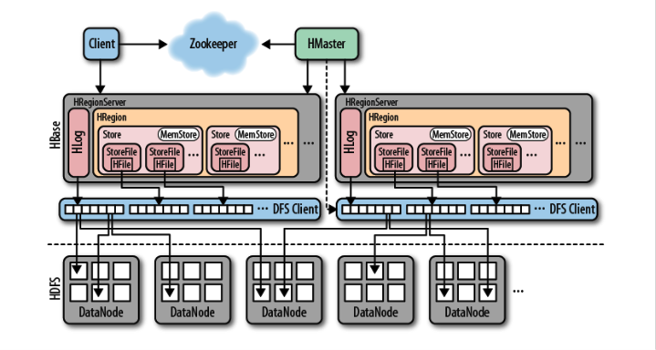

# HBase 기본 개념 정리

## Apache HBase란?
- 대규모 구조화 데이터를 **실시간**으로 읽고 쓰기 위한 **오픈 소스 분산형 NoSQL 데이터베이스**  
- **HDFS** 위에서 동작
- **구조화된 데이터**를 대규모로 저장하고 빠르게 접근할 수 있도록 설계됨

## HBase의 특징

1. **컬럼 패밀리 기반 저장소**  
   - 데이터를 행(Row)이 아닌 **컬럼 패밀리(Column Family)** 단위로 저장  
   - 효율적인 **데이터 압축**과 **빠른 읽기 성능** 제공

2. **선형적 스케일 아웃 구조**  
   - 여러 대의 서버로 **수평 확장** 가능  
   - 클러스터의 노드를 추가하여 성능과 저장 용량을 증가시킬 수 있음

3. **실시간 읽기/쓰기 처리**  
   - 대규모 데이터를 **실시간**으로 읽고 쓸 수 있는 성능 제공  
   - 지연 시간이 짧은 데이터 액세스 지원

4. **자동 샤딩 및 로드 밸런싱**  
   - 테이블은 자동으로 **리전(Region)** 으로 분할되어 여러 서버에 분산 저장됨  
   - **RegionServer** 간의 로드 밸런싱을 통해 부하를 균등하게 분산

5. **강력한 일관성 보장**  
   - 단일 행(Row)에 대한 **원자성 연산**과 **강력한 일관성** 제공  
   - 행 단위의 ACID 특성 지원
   
## HBase 구성 요소

| 구성 요소           | 설명                                                                                       |
|--------------------|-------------------------------------------------------------------------------------------|
| **HMaster**         | HBase 클러스터를 관리하고 메타데이터를 유지하며, Region의 배치 및 로드 밸런싱 담당              |
| **RegionServer**    | 데이터를 저장하고 클라이언트의 읽기/쓰기 요청 처리, 여러 개의 Region을 관리                     |
| **Region**          | 테이블의 일부를 구성하는 단위로, 특정 범위의 로우를 포함하며, 자동으로 분할 및 병합됨             |
| **ZooKeeper**       | 분산 코디네이션 서비스로, 클러스터의 상태 관리 및 구성 정보 유지, HMaster와 RegionServer 간의 협업 지원 |

## HBase 데이터 모델

1. **테이블(Table)**: 행(Row)과 컬럼(Column)으로 구성되며, 각 테이블은 하나 이상의 컬럼 패밀리를 가짐  
2. **행(Row)**: 각 행은 **행 키(Row Key)** 를 가지며, 행 키를 기준으로 정렬되어 저장
3. **컬럼 패밀리(Column Family)**: 유사한 속성의 컬럼들을 그룹화하여 관리하며, 테이블 생성 시 정의
4. **컬럼 퀄리파이어(Column Qualifier)**: 컬럼 패밀리 내에서 실제 컬럼을 식별하는 이름  
   - 컬럼 패밀리와 결합하여 전체 컬럼 이름을 구성
   - 동적으로 추가 가능  
5. **셀(Cell)**: 행(Row) 키, 컬럼 패밀리, 컬럼 퀄리파이어, 타임스탬프의 조합으로 식별되는 단위  
   - 실제 데이터를 저장하며, 여러 버전의 데이터를 타임스탬프를 통해 관리할 수 있음  

## HBase 동작 흐름

1. **데이터 쓰기**  
   - 클라이언트가 **RegionServer**에 데이터를 쓰기 요청  
   - 데이터는 먼저 **MemStore**에 저장되고, 동시에 **WAL(Write-Ahead Log)** 에 기록되어 장애 시 데이터 복구를 지원  
   - MemStore의 데이터가 일정 크기를 넘으면 **HFile**로 디스크에 플러시됨

2. **데이터 읽기**  
   - 클라이언트가 **RegionServer**에 데이터를 읽기 요청  
   - 최신 데이터는 **MemStore**에서 조회하고, 없을 경우 **HFile**에서 검색  
   - **BlockCache**를 활용하여 자주 액세스하는 데이터를 메모리에 캐싱하여 성능 향상
   
## HBase 컴팩션(Compaction)

HBase는 성능 최적화와 저장 공간 회수를 위해 **컴팩션(compaction)** 을 수행함. 컴팩션은 작은 HFile들을 병합하여 더 큰 HFile로 만드는 과정 
**마이너 컴팩션(minor compaction)** 과 **메이저 컴팩션(major compaction)** 으로 구분됨.

### 마이너 컴팩션(Minor Compaction)

- **목적**: 작은 HFile들을 병합하여 파일 수를 줄이고, 읽기 성능을 향상
- **특징**:
  - 일부 HFile만 선택하여 병합 수행
  - 삭제된 데이터나 만료된 셀은 제거되지 않음
  - 자동으로 주기적으로 실행됨

### 메이저 컴팩션(Major Compaction)

- **목적**: 모든 HFile을 하나로 병합, 삭제된 데이터 및 만료된 셀을 완전히 제거함
- **특징**:
  - 해당 Region의 모든 HFile을 병합
  - 삭제 마커(Tombstone)와 만료된 데이터 제거
  
## Tombstone(삭제 마커)

HBase에서 데이터를 삭제하면 실제로 즉시 제거되지 않고, 해당 셀에 **Tombstone** 이라는 삭제 마커가 추가됨.  
이는 HFile이 불변(immutable)이므로 즉각적인 삭제가 불가능하기 때문

1. **Version Delete**: 특정 버전의 데이터를 삭제
2. **Column Delete**: 특정 컬럼의 모든 버전을 삭제
3. **Family Delete**: 특정 컬럼 패밀리의 모든 데이터를 삭제

Tombstone은 메이저 컴팩션 시 실제 데이터와 함께 제거되어 저장 공간이 회수됨.

## HBase의 주요 장점과 단점

| 장점                                       | 단점                                                    |
|------------------------------------------|--------------------------------------------------------|
| 대규모 실시간 데이터 처리 가능                | 복잡한 조인 연산 및 다중 행 트랜잭션 지원 제한               |
| 수평 확장성 우수                            | 스키마 설계 및 관리의 복잡성 증가                           |
| 컬럼 패밀리 기반 저장으로 데이터 압축 및 빠른 읽기 가능 | SQL과 같은 고수준 쿼리 언어 미제공 (별도 프로젝트 필요)        |
| 자동 샤딩 및 로드 밸런싱 지원                 | 컬럼 패밀리 설계 시 성능 및 저장소 활용에 대한 고려 필요       |

