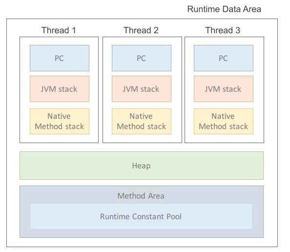

# Java 메모리 구조 및 변수 종류 정리

---

## JVM이란?

- Java Virtual Machine
- 바이트코드를 해석하고 실행
- OS 독립적 실행 가능
- 주요 실행 순서
  - `.java` → 컴파일 → `.class`
  - ClassLoader가 `.class` 파일 JVM 런타임 메모리에 올림

---

## JVM 메모리 구성

### 1. Method Area (Static Area)

- 클래스 정보, static 변수, 메소드 정보 저장
- 클래스 로딩 시 생성, JVM 종료 시 해제
- 어디서든 접근 가능하지만 남용 시 메모리 부족 위험

### 2. Heap Area

- 인스턴스(객체) 저장 공간
- new 키워드로 생성된 객체가 저장
- Stack에 저장된 참조 변수(Reference)가 Heap 객체를 가리킴
- GC(Garbage Collector)에 의해 정리됨
- 모든 스레드가 공유

### 3. Stack Area

- 메서드 호출 시 지역변수, 매개변수 저장
- 메서드 실행이 끝나면 자동으로 해제
- 스레드마다 별도 존재

### 4. PC Register

- 현재 수행 중인 명령어 주소 저장

### 5. Native Method Stack

- C/C++ 같은 네이티브 코드 실행 스택

---

## Java 변수 종류

| 변수 종류 | 선언 위치 | 저장 영역 | 생성 시점 | 소멸 시점 |
|:----------|:-----------|:----------|:---------|:---------|
| 클래스 변수 (static) | 클래스 영역 | Static Area | 클래스 로딩 시 | 프로그램 종료 시 |
| 인스턴스 변수 | 클래스 영역 (static 아님) | Heap | 인스턴스 생성 시 | 인스턴스 소멸 시 |
| 지역 변수 | 메서드 내부 | Stack | 블록 실행 시 | 블록 종료 시 |
| 매개변수 | 메서드 매개변수 | Stack | 메서드 호출 시 | 메서드 종료 시 |

---

# 요약

- **Static 영역**: 프로그램 끝날 때까지 살아있음 (주의 필요)
- **Heap 영역**: 객체 저장, 참조 변수로 접근
- **Stack 영역**: 메서드 실행 시 생성, 종료 시 소멸
- **변수 종류는 선언 위치에 따라 저장 위치가 다름**
