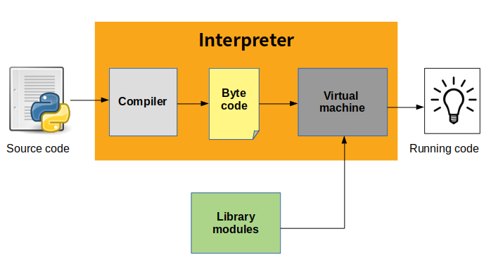

# Python 핵심 개념 정리

## 파이썬은 컴파일 언어인가 인터프리터 언어인가?
**인터프리터 언어이다.**

실행 전에 바이트코드로 컴파일되며, 이 바이트코드는 파이썬 가상 머신(PVM)에 의해 실행한다.


---

## 파이썬의 정렬 알고리즘 - TimSort
파이썬의 `sorted()` 함수와 리스트의 `sort()` 메서드는 **TimSort** 알고리즘을 사용  
TimSort는 병합 정렬과 삽입 정렬의 하이브리드이며, 안정 정렬이다.
- 시간 복잡도
  - 최선: O(n)
  - 평균: O(nlogn)
  - 최악: O(nlogn)
  
---

## 자료구조

### list와 tuple의 차이점

| 특성       | List | Tuple |
|------------|-------------|------------|
| 변경 가능성 | 가변(Mutable) | 불변(Immutable) |
| 성능       | 상대적으로 느림 | 상대적으로 빠름 |
| 메모리 사용 | 더 많음       | 더 적음         |
| 사용 예    | 동적 데이터 저장 | 고정 데이터 저장 |

### set과 dictionary의 차이점

| 특성    | Set        | Dictionary        |
|---------|-----------------|-----------------------------|
| 구조    | 중복 없는 값의 집합 | 키-값 쌍의 집합               |
| 순서    | 순서 없음        | 3.7부터 삽입 순서 유지        |
| 변경성  | 변경 가능        | 변경 가능                    |
| 사용 예 | 유일한 항목 저장  | 키 기반 조회와 저장           |

---

## Iteration?

**Iteration**은 반복 가능한 객체(iterable)를 순차적으로 접근하는 과정

예: `for` 루프를 통해 리스트 요소를 출력
```python
fruits = ['apple', 'banana', 'cherry']
for fruit in fruits:
    print(fruit)
```
**Iterator**: `__iter__()`와 `__next__()` 메서드를 구현한 객체, 반복 가능한 값을 하나씩 반환

---

## 가변 객체와 불변 객체의 차이점
| 특성         | 가변 객체(Mutable)      | 불변 객체(Immutable)     |
|--------------|-------------------------|---------------------------|
| 변경 가능성   | 변경 가능                | 변경 불가능                |
| 예시         | list, dict, set          | tuple, str, int           |


---

## 파이썬 디버깅
파이썬은 `pdb` 모듈을 통해 내장 디버깅 기능을 제공
```bash
python -m pdb your_script.py
```

---

## @staticmethod와 @classmethod 차이점

| 항목           | @staticmethod             | @classmethod               |
|----------------|---------------------------|----------------------------|
| 첫 번째 인자    | 없음                      | cls                        |
| 클래스 정보 접근 | 불가능                    | 가능                       |
| 사용 목적       | 독립 기능                 | 클래스 기반 기능/팩토리     |
| 상속 영향       | 없음                      | 호출한 클래스 기준 동작     |

```python
class MyClass:
    class_var = "shared"

    @staticmethod
    def static_method():
        print("Static method 실행")

    @classmethod
    def class_method(cls):
        print(f"Class method 실행: {cls.class_var}")
```
---

## 함수 인자 전달 방식 (값인가, 참조인가?)
파이썬은 **객체 참조에 의한 전달** 방식(Call by Object Reference)을 사용
불변 객체는 함수 내에서 변경 시 새로운 객체가 생성되며, 가변 객체는 내부 값 변경이 함수 밖에도 영향을 줌

---

## 피클링(Pickling)과 언피클링(Unpickling)

- **Pickling**: 파이썬 객체를 바이트 스트림으로 직렬화하여 파일에 저장하는 과정
- **Unpickling**: 저장된 바이트 스트림을 다시 파이썬 객체로 역직렬화하는 과정

예제:

```python
import pickle

data = {'key': 'value'}
with open('data.pkl', 'wb') as f:
    pickle.dump(data, f)

with open('data.pkl', 'rb') as f:
    loaded = pickle.load(f)
```

---

## `__init__.py`

### 개념
- 해당 디렉토리를 **Python 패키지**로 인식시켜주는 초기화 파일

### 역할
- 패키지 내 모듈/서브패키지 초기화
- 패키지 임포트 시 실행할 코드 정의 가능
- 공용 모듈 import 정리 가능

### 예시 구조

```
mypackage/
├── __init__.py
├── module1.py
├── subpkg/
│   ├── __init__.py
│   └── module2.py
```

---

## Magic Method (스페셜 메서드)

### 개념
- `__init__`, `__str__`, `__add__`처럼 `__이름__` 형식을 가진 메서드
- **연산자 오버로딩**이나 **기본 동작 정의**에 사용

### 주요 메서드 예시

| 이름          | 설명                             |
|---------------|----------------------------------|
| `__init__`    | 생성자                            |
| `__str__`     | `print()` 등 문자열 표현 반환     |
| `__repr__`    | 개발자용 객체 표현                |
| `__add__`     | `+` 연산자 오버로딩               |
| `__call__`    | 객체를 함수처럼 호출 가능하게 함  |
| `__getitem__` | 인덱싱 지원 (`obj[key]`)          |
| `__len__`     | `len(obj)` 사용 가능              |

---

## `if __name__ == "__main__":`

### 개념
- 모듈이 **직접 실행**될 때만 특정 코드를 실행하도록 분기
- 다른 파일에서 import되는 경우에는 실행되지 않음

### 활용 목적
- 모듈과 스크립트 동작을 분리
- 테스트 코드 또는 CLI 진입점 구성

### 예시

```python
def main():
    print("메인 실행 블록입니다.")

if __name__ == "__main__":
    main()
```

```bash
$ python mymodule.py      # 메인 블록 실행됨
$ python -c "import mymodule"  # 메인 블록 실행 안 됨
```
