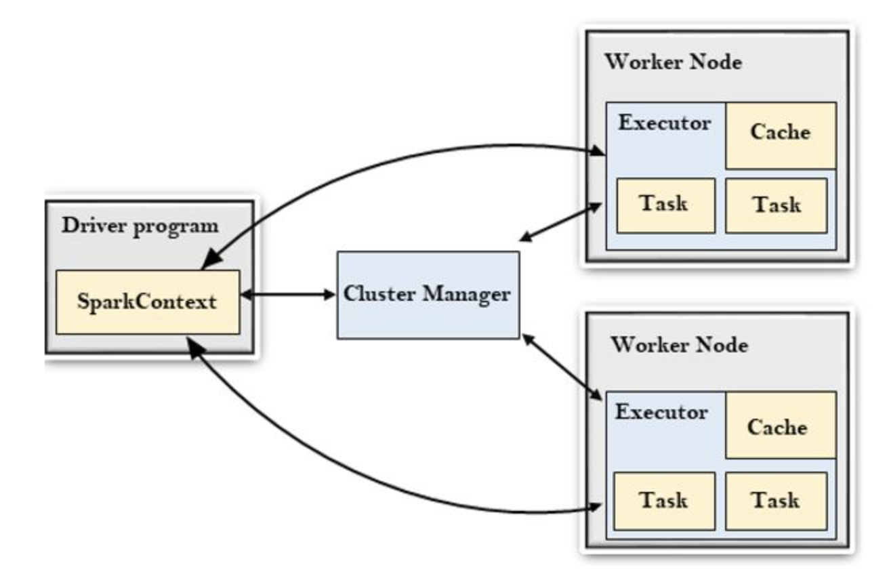

# Spark 기본 개념 정리

## Apache Spark란?
- 대규모 데이터 처리 엔진으로, 빠르고 범용성이 높은 분산 처리 시스템
- Hadoop의 MapReduce 한계를 극복하고, 메모리 기반 처리로 빠른 연산 수행
  - MR의 한계: 디스크 기반으로 속도가 느림, 중간 작업이나 공유를 위해 DISK를 사용하므로 I/O를 많이 사용함

## 구조

### **Spark 구조 설명**

#### **Driver Program**
- 어플리케이션 실행 부, **SparkContext**를 통해 클러스터와 통신 및 작업 조율  

#### **Cluster Manager**
- 클러스터 리소스를 관리  
- **Driver Program**과 **Worker Node** 간의 자원 할당을 조율  

#### **Worker Nodes**
- 실제 데이터를 처리 

#### **Executor**
- 작업(Task)을 수행하고 메모리(RDD)를 캐싱하여 연산 속도를 향상 가능

#### **Task**
- 실제로 연산을 수행하는 가장 작은 단위  
- 하나의 Job이 여러 개의 Task로 나뉘어 **분산 실행**  

#### **Cache**
- 데이터를 메모리에 저장하여 성능 향상 (**RDD**, **DataFrame** 등을 캐싱)  

#### **작업 흐름 요약**
1. **Driver Program**에서 **SparkContext**를 생성하여 애플리케이션 실행
2. **SparkContext**가 **Cluster Manager**에게 작업을 할당
3. **Cluster Manager**는 **Worker Node**에 작업을 분배
4. 각 Worker Node의 **Executor**가 **Task**를 실행하며, 필요한 경우 데이터를 **Cache**에 저장하여 빠르게 접근
5. 작업이 완료되면 **Driver Program**으로 결과를 반환

## Spark 구성 요소

| 구성 요소        | 설명                                                                                     |
|----------------|--------------------------------------------------------------------------------------------|
| Spark Core      | 메모리 기반 분산 처리를 담당하며 RDD와 스케줄링 기능을 제공                                   |
| Spark SQL       | 구조화된 데이터를 처리하며, DataFrame과 SQL 쿼리 지원                                           |
| Spark Streaming | 실시간 데이터 스트리밍 처리                                                           |


## RDD (Resilient Distributed Dataset)
- Spark의 기본 데이터 구조로, **불변성**과 **분산 처리**를 지원
- **불변성 (Immutable)**: 데이터 수정 불가, 변환 시 새로운 RDD 생성  
- **분산성**: 클러스터에 걸쳐 데이터 분산  
- **내결함성 (Fault Tolerance)**: 작업 실패 시 데이터 복구 가능  
  - 계보(Lineage): RDD가 어떻게 생성되었는지 추적할 수 있는 변환 이력

---
**RDD 연산:**  
- **Transformations**: 기존 RDD를 변환하여 새로운 RDD를 생성 (예: `map`, `filter`)  
- **Actions**: RDD의 결과를 반환하거나 저장 (예: `collect`, `count`)  

## **DataFrame의 주요 특징**  
- **구조화된 데이터 처리**: 테이블 형태로 데이터를 구조화하여 SQL 쿼리와 DataFrame API로 쉽게 조작 가능  
- **다양한 데이터 소스 지원**: CSV, JSON, Parquet 등 다양한 포맷과 데이터베이스 연동 가능  
- **고성능 연산**: Catalyst 옵티마이저와 Tungsten 엔진을 통해 연산 성능 최적화  
- **불변성 (Immutable)**: 생성 후 변경 불가, 변환 시 새로운 DataFrame 생성  
- **분산 처리**: 여러 노드에 데이터 분산 저장 및 병렬 처리 지원  
- **내결함성 (Fault Tolerance)**: RDD 계보(Lineage)를 활용하여 노드 장애 시 자동 복구  

## **Dataset**  
Apache Spark의 Dataset은 RDD와 DataFrame의 장점을 결합한 데이터 구조 
- **타입 안전성(Type Safety)**: 컴파일 시점에 데이터 타입 검사로 안정성 보장  
- **구조화된 데이터 처리**: 스키마를 통해 구조화된 데이터 처리 및 SQL 연산 지원  
- **고성능 연산**: Catalyst 옵티마이저와 Tungsten 엔진을 활용한 성능 향상  
- **사용 시기**: 복잡한 연산이 필요하거나 타입 안전성이 중요한 경우 사용  
- **성능 저하 가능성**: 사용자 정의 타입으로 인해 직렬화/역직렬화에서 성능 저하 발생 가능  

## RDD vs DataFrame vs Dataset

| 구분       | RDD                        | DataFrame                       | Dataset                       |
|-----------|----------------------------|--------------------------------|-------------------------------|
| 타입       | 타입 없음                   | 행(Row) 기반                     | 타입 안정성 보장                |
| 사용성     | 함수형 API                   | SQL과 함수형 API 지원             | 타입 안전한 API                |
| 성능       | 비교적 느림                  | 빠름 (카탈리스트 최적화 사용)     | 빠름 (타입 체크로 최적화)        |

---
## Spark 메모리 관리 (2.x 이후)
- **메모리 풀 구조**: Execution Memory와 Storage Memory를 **하나의 메모리 풀**에서 관리  
- **동적 메모리 공유**:  
  - Execution과 Storage가 하나의 풀을 사용하여 **필요에 따라 공간을 공유**  
  - 메모리 부족 시, 한쪽 메모리가 다른 쪽 공간을 사용  

#### **메모리 할당 비율**  
- **spark.memory.fraction = 0.6**: 전체 JVM 힙 메모리의 60%를 메모리 풀로 사용  
- **spark.memory.storageFraction = 0.5**: 메모리 풀의 절반(30%)을 기본 Storage로 할당  
- **동적 조정**: 필요 시 Storage를 줄이고 Execution 메모리로 사용 가능
#### 구조 참고
```python
Executor Heap 전체
├── Non-Spark 메모리 (User JVM memory, Spark 제외)
└── Spark 메모리 풀 (spark.memory.fraction 비율)
     ├── Execution Memory (shuffle, sort, join, aggregation 등)
     └── Storage Memory (RDD/DataFrame Cache, Broadcast variable 등)
         (spark.memory.storageFraction 비율만큼 최소 확보)
```

#### **문제 해결 방법**  
- **메모리 증가**: `spark.executor.memory`, `spark.driver.memory` 늘리기  
- **비율 조정**: `spark.memory.fraction`과 `spark.memory.storageFraction` 조절  
- **캐싱 최적화**: 불필요한 캐시 제거로 Storage 메모리 확보  


## 파티셔닝과 샤플링
- **파티셔닝**: 데이터를 여러 파티션으로 나누어 병렬 처리 가능하게 함  
- **셔플링 (Shuffling)**: 파티션 간 데이터 이동으로 성능 저하 유발  
- **최소화 방법**: `reduceByKey`, `mapPartitions` 등을 이용하여 불필요한 데이터 줄이기  

## Spark와 Hadoop의 차이

| 구분      | Spark                                           | Hadoop                               |
|----------|------------------------------------------------|---------------------------------------|
| 처리 방식 | 메모리 기반 연산으로 빠름                        | 디스크 기반 배치 처리로 느림            |
| 지원 형태 | 배치 + 실시간 스트리밍 지원                       | 배치 처리만 지원                       |
| 활용성    | 머신러닝, 실시간 로그 처리 등 다양한 활용 가능       | 주로 배치 데이터 처리에 사용             |

## Spark Streaming과 DStream
- **DStream (Discretized Stream)**: 시간에 따라 나누어진 RDD의 연속적 시퀀스  
- 실시간 데이터를 **마이크로 배치**로 처리하여 스트리밍 데이터 처리에 적합  

## Catalyst Optimizer
- Spark SQL의 **쿼리 최적화 엔진**으로, 성능 향상을 위한 최적화 수행  
- **최적화 단계**: 논리적 계획 -> 물리적 계획 -> 코드 생성  
- 논리적 계획을 분석하여 효율적인 실행 계획으로 변환하여 성능을 극대화  

---
# Spark Streaming과 Structured Streaming 비교  

Spark 2.x와 3.x의 스트리밍 처리 방식 비교

| 항목                 | Spark Streaming (2.x)              | Structured Streaming (2.x ~ 3.x)                    |
|---------------------|------------------------------------|-----------------------------------------------------|
| 처리 방식           | 마이크로 배치                       | 마이크로 배치 (연속 처리 옵션 있음)                   |
| 데이터 구조         | DStream (RDD 기반)                  | DataFrame / Dataset                                  |
| API 통합성          | RDD 기반                            | SQL 기반의 통합 API                                   |
| 실시간 처리 성능    | 실시간 처리에 한계                   | 실시간 데이터 처리 최적화 (Continuous Processing)       |
| 트랜잭션 지원       | At-least-once (중복 가능성 존재)     | Exactly Once (정확히 한 번 처리)                       |
| 상태 관리           | updateStateByKey로 상태 관리 복잡   | MapWithState, Streaming Aggregation으로 상태 관리 용이 |
| 성능 최적화         | 기본 병렬 처리만 지원                | Catalyst 옵티마이저와 Tungsten 엔진으로 성능 향상       |
| 장애 복구           | WAL 기반 복구 (성능 저하 가능성 있음) | 체크포인트와 WAL로 안정적인 장애 복구 지원              |

## 주요 차이점  

### 1. 처리 방식  
- Spark Streaming (2.x): 마이크로 배치 방식으로 데이터를 처리  
- Structured Streaming (2.x ~ 3.x): 기본적으로 마이크로 배치, Spark 2.3부터 **Continuous Processing** 옵션 추가  
- 연속 처리 모드로 실시간 처리 성능을 크게 향상  

### 2. 데이터 구조  
- Spark Streaming: RDD 기반의 DStream 사용  
- Structured Streaming: DataFrame과 Dataset을 사용하여 실시간 데이터 처리  
- 더 직관적이고 SQL 기반 연산이 가능  

### 3. API 통합성  
- Spark Streaming: RDD API 중심으로 사용  
- Structured Streaming: SQL과 DataFrame API로 일관성 있는 스트리밍 처리  
- 배치와 스트리밍을 동일한 API로 관리할 수 있어 코드의 복잡성 감소  

### 4. 실시간 처리 성능  
- Spark Streaming: 마이크로 배치 단위로 처리하므로 레이턴시 존재  
- Structured Streaming: **Continuous Processing**으로 레이턴시 최소화 (Spark 2.3 이상)  
- 실시간 처리 성능이 크게 개선됨  

### 5. 트랜잭션 지원  
- Spark Streaming: 기본적으로 **At-least-once** 처리, 중복 가능성 존재  
- Structured Streaming: **Exactly Once** 트랜잭션 처리 지원  
  - 특히 Kafka와 연동할 때 정확히 한 번 처리 보장  
  - 소스와 싱크의 일관성을 유지하여 데이터 중복 문제 해결  

### 6. 상태 관리  
- Spark Streaming: 상태 업데이트가 복잡하며, 수동으로 관리해야 함  
- Structured Streaming: 상태를 SQL로 쉽게 관리하며, 상태 질의 기능 제공  
- MapWithState와 같은 고급 상태 관리 API를 통해 지속적 상태 업데이트 가능  

### 7. 성능 최적화  
- Spark Streaming: 단순한 병렬 처리에 의존  
- Structured Streaming: Catalyst 옵티마이저와 Tungsten 엔진으로 성능 향상  
- 스트리밍 처리에서도 배치와 동일한 최적화 기법 사용  

### 8. 장애 복구  
- Spark Streaming: WAL(Write-Ahead Log)를 사용하여 장애 복구 (성능 저하 가능성 있음)  
- Structured Streaming: **체크포인트와 WAL**을 사용하여 보다 안정적으로 장애 복구  
- 장애 발생 시 데이터 유실 없이 복구 가능  


---

## Spark Locality

Spark에서 **데이터 로컬리티(Data Locality)** 는 데이터와 연산이 얼마나 가까운 위치에서 처리되는지를 의미<br>
이는 성능에 큰 영향을 미치며 데이터 이동을 최소화하여 처리 속도를 높이기 위해 Spark는 다음과 같은 로컬리티 수준을 사용
### Spark 로컬리티 수준

| 로컬리티 수준    | 설명                                                                                 | 지연 정도   |
|----------------|----------------------------------------------------------------------------------------|-------------|
| **PROCESS_LOCAL** | 데이터와 코드가 동일 JVM 내에 있어 가장 빠르게 처리됨                                  | 매우 낮음    |
| **NODE_LOCAL**    | 같은 노드의 다른 프로세스나 디스크에 위치하여 약간의 지연 발생                        | 낮음         |
| **NO_PREF**       | 데이터 접근에 특정한 로컬리티 제한이 없음                                             | 중간         |
| **RACK_LOCAL**    | 동일 랙의 다른 노드에 있어 네트워크 전송이 필요함                                      | 높음         |
| **ANY**           | 클러스터 내 어디에나 데이터가 있을 수 있어 가장 높은 지연 발생                         | 매우 높음    |

---

### 스케줄링과 대기 시간 설정

Spark는 가능한 한 **높은 로컬리티 수준**에서 작업을 수행하려 시도함.  
이를 위해 각 수준에서 일정 시간 대기하며, 이 대기 시간은 다음 설정으로 조정 가능:  
- `spark.locality.wait` (기본값: 3초)  
- `spark.locality.wait.node`  (기본값: spark.locality.wait)  
- `spark.locality.wait.process`  (기본값: spark.locality.wait)  
- `spark.locality.wait.rack`  (기본값: spark.locality.wait)  

적절한 대기 시간 설정을 통해 **데이터 이동을 최소화**하고 성능 최적화 가능
