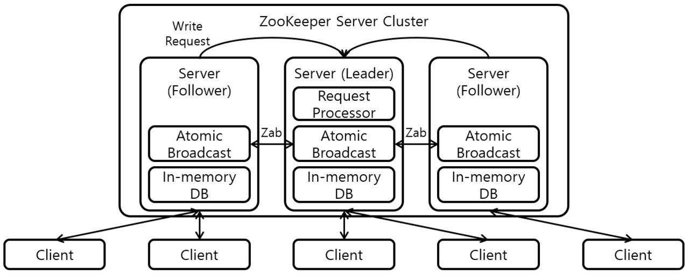

# ZooKeeper

## 1. ZooKeeper란?
- **분산 시스템을 위한 고성능 코디네이션 서비스**
- 주요 기능: **구성 정보 저장**, **이름 서비스**, **분산 락**, **노드 감시**, **그룹 멤버십**
- 여러 클라이언트와 서버 간의 상태 일관성을 보장

## 2. 핵심 개념

### ZNode
- ZooKeeper에서 데이터를 저장하는 단위 (계층적 구조: `/app/config/port`)
- **파일 시스템 디렉토리 구조와 유사**
- 각 ZNode는 최대 **1MB까지 데이터 저장 가능**
- ZNode의 유형:
  - `Persistent`: 세션과 무관하게 유지
  - `Ephemeral`: 세션 종료 시 자동 삭제
  - `Sequential`: 자동 증가 번호가 붙은 ZNode 생성

### Watcher
- ZNode의 상태 변경(생성, 삭제, 데이터 변경 등)을 감지
- **1회성** 감시: 이벤트 발생 후 다시 등록해야 함
- 비동기 알림 처리

### Session
- 클라이언트와 ZooKeeper 서버 사이의 연결 단위
- **Ephemeral ZNode**는 해당 세션이 끊기면 사라짐
- 각 클라이언트는 고유한 Session ID를 갖고 heartbeat를 전송함

## 3. 아키텍처

### 구성 요소
- **Leader**: 쓰기 요청 처리, 트랜잭션 커밋 주도
- **Follower**: 읽기 요청 처리, 리더로부터 상태 복제
- **Observer**:
  - zookeeper ensemble에 참여는 하나, 투표 권한 없음 (선거 참여 X)
  - 읽기 처리만 담당 (읽기 확장 시 사용)

## 4. 주요 특징
- **CAP 이론 중 CP(일관성과 가용성)** 지향
- **ZAB (Zookeeper Atomic Broadcast Protocol)** 프로토콜 기반
  - 데이터 일관성, 내결함성 보장하기 위해 사용하는 커밋 프로토콜
  - 분산 환경에서 트랜잭션 순서 보장
  - 리더 장애 발생 시 안전한 리더 선출 및 상태 복구
- 높은 일관성 보장
- 클라이언트는 모든 서버에 연결할 수 있지만, 쓰기는 리더만 가능

## 5. 사용 사례
- **Apache Kafka**: 브로커, 컨슈머 그룹 정보 저장
- **Apache HBase**: 마스터와 RegionServer 간 상태 동기화
- **분산 락 서비스**
- **서비스 디스커버리**
